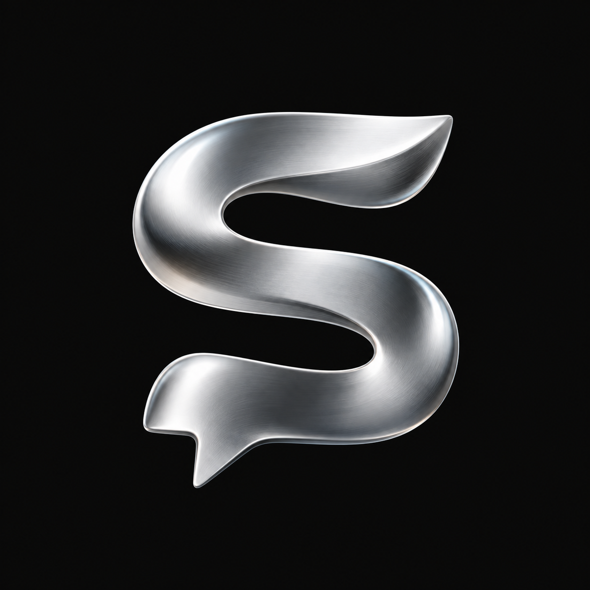
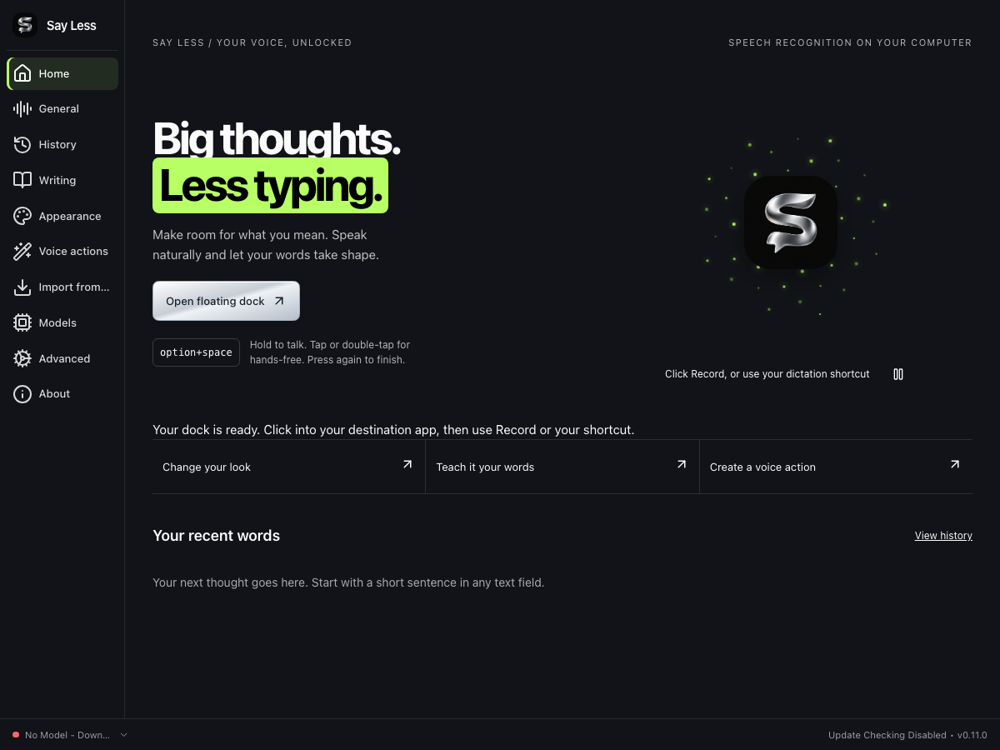
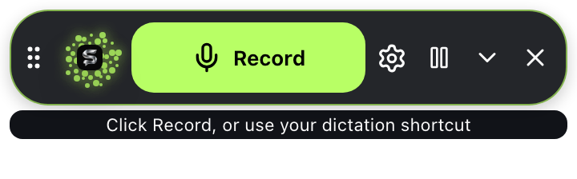
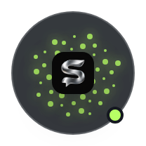
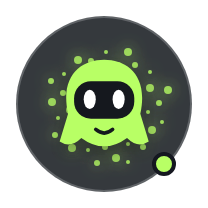
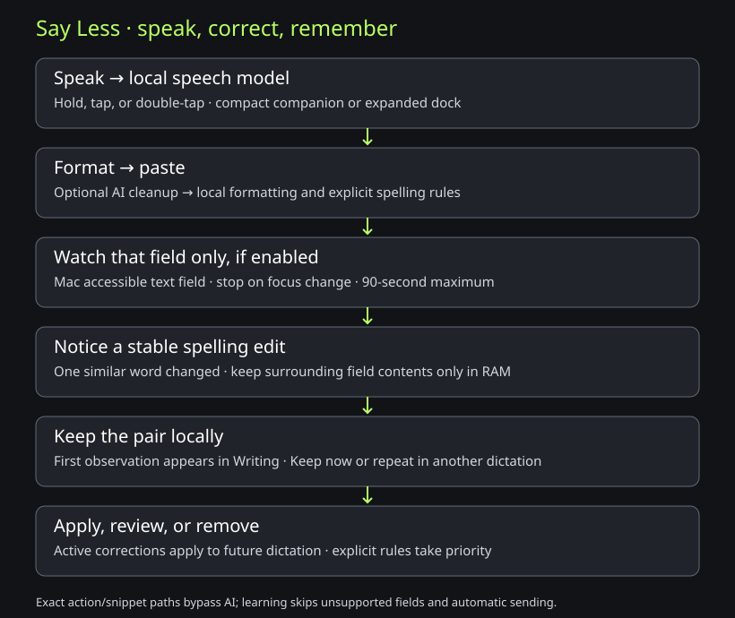
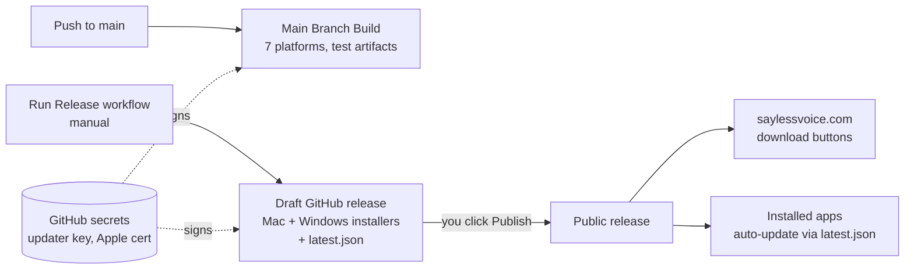
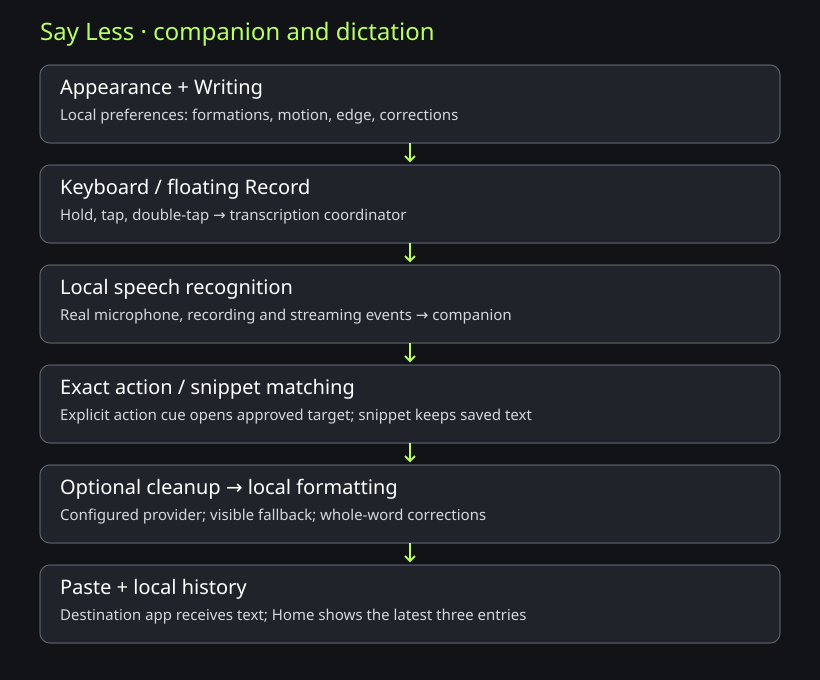
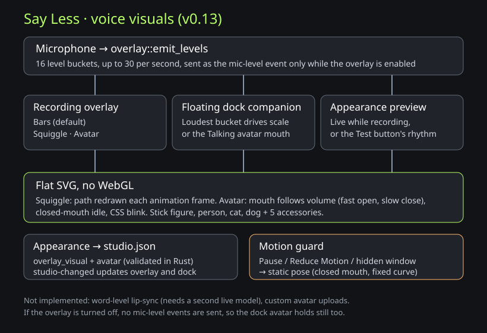

# Say Less



## See it first



| Expanded controls                                                                                                       | Collapsed companion                                                                                | Animated character                                                                                                     |
| ----------------------------------------------------------------------------------------------------------------------- | -------------------------------------------------------------------------------------------------- | ---------------------------------------------------------------------------------------------------------------------- |
|  |  |  |

These are actual application screens rendered with safe sample state. The still images show the controls; motion is enabled in the app unless paused or Reduce Motion is on.

**Three things to try:**

1. **Home → Open floating dock.** The shortcut shown on Home works while the dock is collapsed. Click the little companion to expand, then use the down arrow to collapse.
2. **Appearance → Companion style.** Choose an orb, chrome emblem, character, or character with particles. Set Left/Right placement, color, pause, or cycle.
3. **Writing → Learn from my corrections.** Enable on Mac, dictate into a supported text field, fix one spelling and keep focus there for four seconds. Review the observed pair, choose Keep now, or repeat it in another dictation to activate it automatically. Remove a learned rule anytime.

### How the words move



[Editable diagram](docs/diagrams/learning.mmd) · [Detailed behavior and limits](docs/personalization.md) · [Local verification](docs/verification/compact-0.12.0.md)

[Brand assets and coaching-portal usage](docs/brand.md)

Open **Writing** for personal vocabulary, filler cleanup, and local voice snippets. Save a cue such as “my booking link,” then use the preview to check its exact expansion. [Wispr Flow capability comparison and remaining gaps](docs/wispr-comparison.md) · [UI verification standard](docs/UI-STANDARD.md).

Local voice dictation built on Handy. The current custom build is verified on Apple Silicon macOS. Windows support is inherited from Handy; this version has not yet been packaged or verified on Windows.

- **Free.** No subscription, no account.
- **Private dictation.** Speech recognition runs on your computer. Optional cloud post-processing sends the transcript to the provider you configure; leave it off for fully local dictation.
- **Model choice.** Memory use depends on the speech model you select.

## Install

Installer releases are not published yet (checked September 23, 2026). Build locally using the instructions below. When installers are available, they will appear in [Releases](https://github.com/Dreydrey9000/say-less/releases):

- **Mac:** the `.dmg` (`aarch64` = Apple Silicon M1/M2/M3/M4, `x64` = older Intel Macs)
- **Windows:** the `x64-setup.exe`

On first launch, allow **Microphone** and **Accessibility** access. Accessibility lets Say Less type for you.

## Try Nemotron locally

In **Models**, search for **Nemotron Streaming 3.5**, download it, and select it. The default Q8 model is approximately 751 MB. Model download requires internet; speech recognition works offline after download. Enable the live preview overlay to see partial text while speaking, then release the shortcut to finish and paste.

Nemotron is optional. Keep your existing Parakeet or Whisper model available so you can switch back in Models. Performance on an 8GB machine has not yet been measured for this fork.

See [Nemotron verification and troubleshooting](docs/nemotron.md) and the [dictation architecture](docs/diagrams/dictation.svg) ([editable Mermaid source](docs/diagrams/dictation.mmd)). The runtime and model catalog already include Nemotron support inherited from Handy; no external voice service or Python server is required.

## Build from source

Requires [Rust](https://rustup.rs) and [Bun](https://bun.sh).

```bash
bun install
bun run tauri dev      # run locally
bun run tauri build    # make an installer for this OS
```

## Website and releases



[Editable diagram](docs/diagrams/release.mmd)

- **Website** lives in `site/` (one HTML file) and is hosted on Cloudflare Pages project `say-less` at [saylessvoice.com](https://saylessvoice.com). Deploy with `cd site && npx wrangler pages deploy . --project-name say-less --branch main`. When a release is published, set the installer links in the `DOWNLOADS` object at the bottom of `site/index.html`.
- **Releases:** GitHub > Actions > Release > Run workflow. It builds a draft release named after the version in `src-tauri/tauri.conf.json`. Test the installers, then click Publish.
- **Secrets** (GitHub > Settings > Secrets): `TAURI_SIGNING_PRIVATE_KEY` and `TAURI_SIGNING_PRIVATE_KEY_PASSWORD` sign auto-updates. If they are lost, installed copies can never update again, so keep a backup in the password vault. Apple signing secrets are uploaded with `scripts/setup-apple-signing.sh`. Only `main` and Release builds receive secrets; pull-request builds never do.

## Credits

Say Less is a rebranded fork of [Handy](https://github.com/cjpais/Handy) by CJ Pais, used under the MIT License (see `LICENSE`). Upstream docs: `UPSTREAM-HANDY-README.md`.
To pull upstream fixes: `git fetch upstream && git merge upstream/main`.

## Personalize and migrate

See [appearance, floating dock, voice actions, and Wispr import](docs/personalization.md). The [editable architecture diagram](docs/diagrams/personalization.mmd) shows local storage and action boundaries ([rendered version](docs/diagrams/personalization.svg)).

### Companion and dictation controls

See [personalization](docs/personalization.md) and the [editable companion workflow](docs/diagrams/companion.mmd) for animations, screen-edge placement, hold/tap gestures, and formatting with spelling corrections.



### Voice visuals

In **Appearance → Voice visuals**, switch the recording overlay between Bars (default), a Squiggle line, or a talking Avatar, and build the avatar (stick figure, person, cat or dog; colors; cap, beanie, crown, headphones or sunglasses). The mouth follows voice volume, not words. Pause and Reduce Motion hold it still. See [personalization](docs/personalization.md#voice-visuals) and the [editable voice visuals diagram](docs/diagrams/voice-visuals.mmd).


