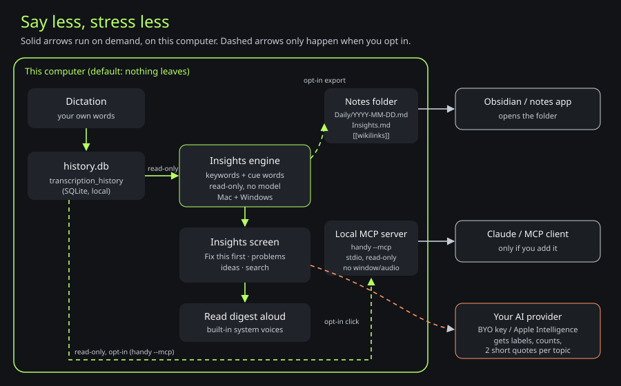

# Say less, stress less

Your dictation history, turned into a private memory of what you keep saying.
Open **Insights** in the sidebar to see recurring problems ("you've mentioned
the video export audio 27 times"), recurring ideas ("you had this app idea on
9/17"), and the one thing to fix first. Every example comes with the date you
said it.



[Editable Mermaid source](diagrams/stress-less.mmd)

## Privacy boundaries

| Feature                    | What it reads                                                          | Where anything goes                                                                                             | Default                               |
| -------------------------- | ---------------------------------------------------------------------- | --------------------------------------------------------------------------------------------------------------- | ------------------------------------- |
| Insights screen and search | `history.db` + Wispr import, read-only                                 | Nowhere. Computed on this computer when you open the screen.                                                    | On                                    |
| Read digest aloud          | The digest on screen                                                   | Your computer's built-in voices (Web Speech API)                                                                | Click only                            |
| Notes export               | `history.db` + Wispr import, read-only                                 | A folder you choose (default `~/Documents/Say Less Notes`)                                                      | Off                                   |
| Use with Claude (`--mcp`)  | `history.db` + Wispr import, read-only                                 | Only to the MCP app you add it to (e.g. Claude Code). That app decides what it sends to its own model.          | Off until you add it                  |
| Summarize with AI          | Topic labels, counts and up to 2 short quotes per topic (max 8 topics) | The AI provider you already set up in AI cleanup (your API key, a custom/local endpoint, or Apple Intelligence) | Click only; disabled with no provider |

Nothing on this list writes to your history. Every database connection is
opened with SQLite's read-only flag.

## How topics are found (no model)

The engine lives in `src-tauri/src/insights/engine.rs` and runs the same on
Mac and Windows:

1. Lowercase each dictation, drop filler and common words ("um", "the",
   "really"), and fold simple plurals ("bugs" → "bug").
2. Collect keyword phrases: single words and two-word phrases that sit next to
   each other ("video export").
3. Rank phrases by how many dictations use them. Two-word phrases rank higher,
   and phrases found in more than 40% of a large history count as too generic.
4. Group dictations under the strongest phrase. Related phrases that mostly
   appear in the same dictations fold into that topic, and a matching
   three-word phrase can become the label ("video export audio").
5. Label each topic from cue words in its dictations:
   - **Problem:** annoying, keeps, broken, doesn't work, can't, hate,
     frustrated, bug, again, wish, stuck, crash, error…
   - **Idea:** idea, what if, we should, I want to build, app that, maybe we
     could, would be cool…
   - Anything else is **Other**.
6. Pick up to 3 example quotes per topic (the sentence that mentions it,
   newest first) with dates.

"Fix this first" is the problem mentioned in the most dictations. Ties go to
the most recent one. Windows: 7, 30 or 90 days, or all time.

Speed: 10,000 dictations take about half a second in a debug build (see the
`ten_thousand_entries_are_fast` test).

### Limits

- The word lists are English. Other languages still group by repeated words,
  but Problem/Idea labels will mostly show as Other.
- It matches words, not meaning. "Export sound" and "render audio" are two
  topics unless you use the same words.
- A dictation counts once per topic. The same sentence can appear in two
  topics if it mentions both.
- Imported Wispr Flow history (`wispr-history.sqlite`) counts everywhere
  history is read (Insights, search, notes export, `--mcp`), read-only; a
  missing or damaged import file is skipped and logged.
- History retention settings still apply. Deleted dictations disappear from
  Insights too.

## Notes export (Obsidian-friendly)

In **Insights → Notes export**, turn on **Export notes nightly** or click
**Export now**. Say Less writes:

- `Daily/YYYY-MM-DD.md`: every dictation that day with its time, plus links to
  the recurring topics mentioned that day.
- `Insights.md`: the last 30 days of topics with counts, example quotes and
  `[[YYYY-MM-DD]]` links back to each day.

Rules it follows:

- It writes a file only if the file is new or already carries the
  `generated_by: say-less` marker at the top. Any other file at that path is
  left untouched and reported as skipped.
- It never deletes anything, and it rewrites a file only when the contents
  changed.
- The nightly run checks about 90 seconds after launch and then every hour.
  It exports when the setting is on and 24 hours have passed.
- If the folder can't be written, the screen shows the reason and the folder
  path.

Settings live in `insights.json` in the app data folder. That file stays
separate from the main settings.

## Use with Claude (local MCP server)

MCP (Model Context Protocol) is a standard way for AI apps to call local
tools. Running the app binary with `--mcp` (`handy --mcp`) starts a small read-only server over stdin/stdout. It
does not open a window or the tray, start audio, or connect to a running Say
Less. It exits when the AI app closes the connection.

The **Use with Claude** panel shows both setups with the real path to the app
on your computer. Examples:

```bash
# Claude Code
claude mcp add say-less -- "/Applications/Say Less.app/Contents/MacOS/handy" --mcp
```

```json
{
  "mcpServers": {
    "say-less": {
      "command": "/Applications/Say Less.app/Contents/MacOS/handy",
      "args": ["--mcp"]
    }
  }
}
```

Tools:

| Tool                 | Inputs                                                       | Returns                                            |
| -------------------- | ------------------------------------------------------------ | -------------------------------------------------- |
| `search_transcripts` | `query` (required), `days`, `limit` (max 100)                | Matching dictations, newest first, with dates      |
| `recent_transcripts` | `days` (default 7), `limit` (default 30)                     | Latest dictations                                  |
| `recurring_topics`   | `days` (default 30), `kind` (`all`/`problem`/`idea`/`other`) | Topics with counts, dates, quotes, and "fix first" |

Where it looks for history:

1. `--history-db <path>`
2. `SAYLESS_HISTORY_DB` environment variable
3. The app's own folder:
   - macOS: `~/Library/Application Support/com.dreythomas.sayless/history.db`
   - Windows: `%APPDATA%\com.dreythomas.sayless\history.db`
   - Portable installs: `Data/history.db` next to the app

Imported Wispr history is read from `wispr-history.sqlite` in the same folder
as that `history.db`. Each result carries `"source": "say_less"` or
`"source": "wispr"`; Wispr results use negative `id`s.

Try it by hand against a copy of your history:

```bash
cp ~/Library/Application\ Support/com.dreythomas.sayless/history.db /tmp/copy.db
printf '%s\n' \
  '{"jsonrpc":"2.0","id":1,"method":"initialize","params":{"protocolVersion":"2025-06-18"}}' \
  '{"jsonrpc":"2.0","method":"notifications/initialized"}' \
  '{"jsonrpc":"2.0","id":2,"method":"tools/call","params":{"name":"recurring_topics","arguments":{"days":30}}}' \
  | "/Applications/Say Less.app/Contents/MacOS/handy" --mcp --history-db /tmp/copy.db
```

Windows note: release builds use the Windows GUI subsystem, so there is no
console window. Piped stdin/stdout from MCP clients still works. This has not
been tested on Windows yet.

## Summarize with AI

This button reuses the provider from **AI cleanup**. That can be your own
API key, a custom endpoint (such as a local Ollama server), or Apple
Intelligence on supported Macs. It sends only the text built by
`build_payload` in `src-tauri/src/insights/summary.rs`: up to 8 topic labels
with counts, up to 2 quotes per topic cut to 140 characters, and the "fix
first" label. The provider is told to treat the quotes as data, not
instructions. Nothing runs automatically.

## Read aloud

**Read digest aloud** uses the webview's built-in `speechSynthesis`, which
means your operating system's voices, offline and with no extra download. It
reads the AI digest if you made one, otherwise a plain local digest.

Future voice upgrade: [Kokoro](https://huggingface.co/hexgrad/Kokoro-82M), a
small free local voice model, could replace system voices for a more natural
read-out. It is not bundled.

## Files

- `src-tauri/src/insights/engine.rs`: topic engine and tests
- `src-tauri/src/insights/db.rs`: read-only SQLite access, search, data-dir
  lookup
- `src-tauri/src/insights/export.rs`: Markdown rendering and safe writes
- `src-tauri/src/insights/mcp.rs`: stdio JSON-RPC MCP server
- `src-tauri/src/insights/summary.rs`: opt-in AI digest
- `src-tauri/src/insights/mod.rs`: Tauri commands, settings, nightly export
- `src/components/insights/`: the Insights screen
- `tests/insights.spec.ts`: renderer tests with simulated IPC (run in CI)
